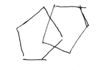

<p align="center"><br></p>
<h3 align="center">Object Detection</h3>
<p align="center">
  Object detection using SciKit Learn and OpenCV
</p>

# Object Detection and Classification with Python, Scikit-Learn, Scikit-Image and OpenCV

This repository contains code to detect and classify objects as pentagon figures or handwriting on a page using Python, Scikit-Learn, and Scikit-Image.

## Installation

To use this code, you'll need to install the following:

- Python 3 (https://www.python.org/downloads/)
  - Version 3.9.12

The [requirement.txt](requirements.txt) file contains the list of dependencies used with python 3.9.12:

```bash
pip install -r requirements.txt
```

I have provided a sample trained model in the `model` directory. You can use this model to test the code.

To train your own model, you'll need to create a dataset. There is a helper scripts in the helpers directory named `multi_select_roi.py` in the directory to to select and crop the areas you want to designate as the negative and positive features. If you only want to output the bounding boxes, you can use the `select_roi_bounding_box.py` script.
> Note: The script will save the cropped images in the `root directory of the target images` directory. You can specify which features you are saving with 0[negative] and 1[positive] positional arguments. 
  
```bash
  # save negative features
  python multi_select_roi.py 0
```

```bash
  # save positive features
  python multi_select_roi.py 1
```

## Usage
There is a notebook [object_detection.ipynb](object-detection.ipynb) that contains the code to train and test the model. You can use this notebook to train your own model.

## References
- [Scikit-Learn](https://scikit-learn.org/stable/)
- [Scikit-Image](https://scikit-image.org/)
- [OpenCV](https://opencv.org/)\

## Author
- [Tim Truty](https://timtruty.com)

